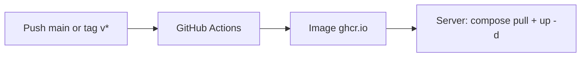

# ISO Watcher

[](README.md) [](README.en.md) [](LICENSE)

Automatic monitoring of ISO releases (HTTP/FTP mirrors): detection, REST API, notifications (email, Discord, Teams, Slack, webhooks), and optional local storage.

| | |
|---|---|
| **Version** | 0.2.0 |
| **Runtime** | Node.js ≥ 20 |
| **Default database** | SQLite |
| **Optional database** | MySQL / MariaDB |
| **Default port** | 3088 |

## Table of contents

- [What is it for?](#what-is-it-for)
- [Prerequisites](#prerequisites)
- [Generating `INTRANET_SHARED_TOKEN`](#generating-intranet_shared_token)
- [Choosing an installation method](#choosing-an-installation-method)
- [Quick install (script)](#quick-install-script)
- [Local development](#local-development)
- [Docker](#docker)
  - [Automatic updates (CI → docker compose pull)](#automatic-updates-ci--docker-compose-pull)
- [After installation](#after-installation)
- [Web interfaces](#web-interfaces)
- [Configuration](#configuration)
- [Features](#features)
- [API and authentication](#api-and-authentication)
- [Local ISO storage](#local-iso-storage)
- [Scans, logs, and restarts](#scans-logs-and-restarts)
- [Repository structure](#repository-structure)
- [Troubleshooting](#troubleshooting)
- [Documentation](#documentation)
- [Credits](#credits)
- [License](#license)

## What is it for?

1. You configure **sources** (ISO directory URLs + filtering regex).
2. The service **scans** periodically or on demand.
3. **New releases** are stored in the database and can trigger **notifications**.
4. Optionally, ISO files are **downloaded** to disk (`STORAGE_ROOT`).

Typical use cases: internal mirror, tracking Ubuntu/Debian/Arch, infra team alerts, intranet catalogue.

## Prerequisites

| Mode | Requirements |
|------|----------------|
| **Development** | Node.js 20+, npm, `git clone` |
| **`install.sh` script** | Debian or Ubuntu, `apt`, `systemd`, root or `sudo` |
| **Docker** | Docker Engine + Compose v2 |

Required before first start: **`.env`** (copy from [`.env.example`](.env.example)) with at least `INTRANET_SHARED_TOKEN` set (see [token generation](#generating-intranet_shared_token) below).

## Generating `INTRANET_SHARED_TOKEN`

**Mandatory** secret at startup. It stays in **`.env` on the server**. Use the **same** token on the intranet PHP client or other API callers.

1. Open the online generator: [IT Tools - Token generator](https://it-tools.tech/token-generator)
2. Generate a token (recommended length: **64 characters** or more)
3. Paste it in `.env`:

```env
INTRANET_SHARED_TOKEN=
```

> The [`install.sh`](scripts/install.sh) script can also generate a token automatically during installation. Never commit `.env` if you fork the project.

## Choosing an installation method

| Goal | Method |
|------|--------|
| Debian/Ubuntu server (prod, LXC) | [`scripts/install.sh`](#quick-install-script) |
| Server + local MariaDB | Script with `--mysql` |
| Test / dev workstation | [Local development](#local-development) |
| Container, SQLite only | [Docker Compose](#docker) - `pull` + `up -d` |
| Container + MySQL | `docker-compose.mysql.yml` |
| Docker prod update | `docker compose pull && docker compose up -d` |

## Quick install (script)

Repository: [github.com/sannier3/ISO-WATCHER](https://github.com/sannier3/ISO-WATCHER) - script: [`scripts/install.sh`](https://github.com/sannier3/ISO-WATCHER/blob/main/scripts/install.sh)

Targets **Debian / Ubuntu**: installs Node 20, clones the repo to `/opt/iso-watcher`, creates `.env`, installs npm dependencies, and the `iso-watcher` systemd unit.

**LXC / container (often already root, no `sudo`):**

```bash
curl -fsSL https://raw.githubusercontent.com/sannier3/ISO-WATCHER/main/scripts/install.sh | bash
```

**Classic machine with `sudo`:**

```bash
curl -fsSL https://raw.githubusercontent.com/sannier3/ISO-WATCHER/main/scripts/install.sh | sudo bash
```

**With MariaDB** (`mariadb-server` package, database + user, `DB_DRIVER=mysql` in `.env`):

```bash
curl -fsSL https://raw.githubusercontent.com/sannier3/ISO-WATCHER/main/scripts/install.sh | bash -s -- --mysql
```

**Useful options:**

```bash
bash scripts/install.sh --help
bash scripts/install.sh --dir /opt/iso-watcher --no-start
bash scripts/install.sh --repo sannier3/ISO-WATCHER --branch main
```

**Uninstall:**

```bash
curl -fsSL https://raw.githubusercontent.com/sannier3/ISO-WATCHER/main/scripts/install.sh | bash -s -- --uninstall
curl -fsSL https://raw.githubusercontent.com/sannier3/ISO-WATCHER/main/scripts/install.sh | bash -s -- --uninstall --purge
```

Script environment variables: `ISO_WATCHER_REPO`, `ISO_WATCHER_BRANCH`, `ISO_WATCHER_INSTALL_DIR`, `MYSQL_DATABASE`, `MYSQL_USER`, `MYSQL_PASSWORD`.

The systemd unit automatically adds `ReadWritePaths` for `STORAGE_ROOT` or `SQLITE_PATH` when they are **outside** `/opt/iso-watcher` (e.g. `/mnt/ISO`).

## Local development

```bash
git clone https://github.com/sannier3/ISO-WATCHER.git
cd ISO-WATCHER
cp .env.example .env
# Set INTRANET_SHARED_TOKEN (required) - see "Generating INTRANET_SHARED_TOKEN"

npm install
npm start
# or: npm run dev   (hot reload)
```

## Docker

**No `git clone` required**: fetch `docker-compose.yml` (and optionally `docker-compose.mysql.yml`) plus a `.env` file, then run the published GHCR image.

### First install (without cloning the repo)

Create a dedicated folder (e.g. `/opt/iso-watcher-docker`):

```bash
mkdir -p /opt/iso-watcher-docker && cd /opt/iso-watcher-docker

curl -fsSL -o docker-compose.yml \
  https://raw.githubusercontent.com/sannier3/ISO-WATCHER/main/docker-compose.yml

curl -fsSL -o .env \
  https://raw.githubusercontent.com/sannier3/ISO-WATCHER/main/.env.example

# Set INTRANET_SHARED_TOKEN (required) - see README, token generation section
```

**SQLite** (registry image, no local build):

```bash
docker compose pull
docker compose up -d
```

**MySQL** (also download the MySQL compose file):

```bash
curl -fsSL -o docker-compose.mysql.yml \
  https://raw.githubusercontent.com/sannier3/ISO-WATCHER/main/docker-compose.mysql.yml

# .env: DB_DRIVER=mysql + passwords aligned with docker-compose.mysql.yml
docker compose -f docker-compose.mysql.yml pull
docker compose -f docker-compose.mysql.yml up -d
```

### If you already cloned the repo

```bash
cp .env.example .env
# INTRANET_SHARED_TOKEN required
# Default image: ghcr.io/sannier3/iso-watcher:latest (see ISO_WATCHER_IMAGE)
docker compose pull && docker compose up -d
```

**Local build** (dev, without waiting for CI):

```bash
docker compose -f docker-compose.yml -f docker-compose.build.yml up -d --build
```

Persistent data: volumes `iso_watcher_data` (SQLite) or `iso_watcher_storage` + `iso_watcher_mysql`.

### Automatic updates (CI → `docker compose pull`)

Recommended flow:



1. **CI**: workflow [`.github/workflows/docker-publish.yml`](.github/workflows/docker-publish.yml) pushes to **ghcr.io/sannier3/iso-watcher**:
   - push to `main` → **`latest`** (use in prod)
   - git tag `v0.2.1` → `0.2.1`, `0.2` (no `sha-*` tags published)

2. **Enable packages** (once on GitHub): *Settings → Actions → General* → allow workflows to write packages. The image appears under the repo *Packages*.

3. **Private registry** (optional): on the server, once:
   ```bash
   echo "$GITHUB_TOKEN" | docker login ghcr.io -u YOUR_USER --password-stdin
   ```

4. **Update the server**:
   ```bash
   docker pull ghcr.io/sannier3/iso-watcher:latest
   docker compose pull
   docker compose up -d --remove-orphans
   ```
   Or: `./scripts/docker-update.sh`  
   Do not use old `sha-…` tags: prefer **`:latest`** or version **`0.2.0`** after a git tag.

5. **Pin a version** (optional, after `git tag v0.2.0 && git push origin v0.2.0`):
   ```env
   ISO_WATCHER_IMAGE=ghcr.io/sannier3/iso-watcher:0.2.0
   ```
   Default (recommended to follow `main`):
   ```env
   ISO_WATCHER_IMAGE=ghcr.io/sannier3/iso-watcher:latest
   ```

Health check: `curl -s http://127.0.0.1:3088/health`

## After installation

1. Check the service: `curl -s http://127.0.0.1:3088/health`
2. Open the UI: `http://<host>:3088/`
3. Admin console: `http://<host>:3088/admin` (see [SECURITY.md](SECURITY.md) / [SECURITY.en.md](SECURITY.en.md) for auth)
4. Configure SMTP / notifications if needed (`.env`)
5. Create an ISO and sources via admin or API
6. Run a test scan: `POST /api/v1/scans` (with token)

**systemd (script install):**

```bash
systemctl status iso-watcher
journalctl -u iso-watcher -f
systemctl restart iso-watcher   # after .env changes
```

## Web interfaces

| URL | Role |
|-----|------|
| `/` | Public catalogue, health, optional actions (FR/EN UI) |
| `/admin` | Console: ISO, sources, scans, releases, notifications, storage |
| `/docs` | API documentation (HTML) |
| `/docs/API.md` | API reference (Markdown, French) |
| `/docs/API.en.md` | API reference (Markdown, English) |
| `/health` | JSON health (no auth) |

## Configuration

All variables are documented in [`.env.example`](.env.example). Never commit **`.env`** if you fork the project.

| Group | Key variables |
|--------|----------------|
| Application | `APP_HOST`, `APP_PORT`, `INTRANET_SHARED_TOKEN`, `CORS_ORIGIN` |
| Public UI | `PUBLIC_UI_*` |
| Admin UI | `ADMIN_UI_*` |
| Database | `DB_DRIVER`, `SQLITE_PATH`, `MYSQL_*` |
| ISO storage | `STORAGE_*` |
| Scheduled scans | `SCHEDULER_*`, `SCAN_STARTUP_RECOVERY` |
| Scan logs | `SCAN_MAX_LOG_LINES`, `SCAN_LOG_*` (see dedicated section) |
| Dead links / admin reports | `LINK_CHECK_*`, `ADMIN_NOTIFY_CHANNELS`, `ADMIN_EMAIL`, admin webhooks |
| User notifications | API `POST /users/:id/destinations` - types via `GET /destination-types` |
| Deliveries | `SMTP_*`, `DELIVERY_CRON`, `DISCORD_*`, `TEAMS_*` |

## Features

- Recursive directory discovery (regex `discovery_regex`)
- ISO file filtering (`match_regex`)
- Manual, per-ISO, per-source, or scheduled scans (cron)
- Immediate and digest notifications
- Daily release link verification
- Recovery of interrupted scans on process restart
- Private network restrictions for UIs (RFC1918)

## API and authentication

Full reference: [`docs/API.md`](docs/API.md) (French) · [`docs/API.en.md`](docs/API.en.md) (English).

**REST API** (`/api/v1/*`) - required headers:

```http
X-Intranet-Token: <INTRANET_SHARED_TOKEN>
X-Actor-Username: admin
X-Actor-Type: internal
```

**Web UIs** - signed session `X-UI-Session` (no token in the browser). Details and checklist: [SECURITY.md](SECURITY.md) / [SECURITY.en.md](SECURITY.en.md).

Quick example:

```bash
export TOKEN="your-token"
curl -s -H "X-Intranet-Token: $TOKEN" -H "X-Actor-Username: admin" -H "X-Actor-Type: internal" \
  http://127.0.0.1:3088/api/v1/admin/overview
```

## Local ISO storage

**Disabled by default** (`STORAGE_ENABLED=false`).

- Only releases **known in the database** are managed; files outside the DB are never deleted.
- `STORAGE_USE_SUBFOLDERS=true` → `{STORAGE_ROOT}/{distribution}/{iso}/{file}`
- `STORAGE_DOWNLOAD_ON_DETECT=true` → download on detection
- API: `POST /api/v1/releases/:id/download`, `GET /api/v1/releases/:id/local-file`

If `STORAGE_ROOT` points to a mount (e.g. `/mnt/ISO`), ensure write permissions and, with systemd, `ReadWritePaths` (handled by `install.sh`).

## Scans, logs, and restarts

| Variable | Role |
|----------|------|
| `SCAN_STARTUP_RECOVERY=interrupt` | On Node restart, in-progress scans become **interrupted** (default) |
| `SCAN_STARTUP_RECOVERY=ignore` | Do not touch orphaned `running` scans |
| `SCAN_MAX_LOG_LINES` | Line limit in DB (`0` = unlimited) |
| `SCAN_LOG_MIN_LEVEL` | `debug`, `info`, `warn`, `error` - noise filter |
| `SCAN_LOG_API_DEFAULT_LIMIT` | Log lines returned by admin API |

Scan logs include ISO name, source name, and explored URL.

## Repository structure

```
iso-watcher/
├── server.js              # API entry + scheduler
├── lib/                   # config, database, storage, UI sessions
├── public/                # Public UI (/)
├── public/admin/          # Admin console (/admin)
├── public/i18n.js         # FR/EN UI strings
├── docs/
│   ├── API.md             # API reference (French)
│   ├── API.en.md          # API reference (English)
│   └── api.html           # /docs page
├── scripts/
│   ├── install.sh         # Debian/Ubuntu + systemd
│   └── docker-update.sh   # pull + up -d
├── .github/workflows/
│   └── docker-publish.yml # CI → ghcr.io
├── Dockerfile
├── docker-compose.yml     # SQLite
├── docker-compose.mysql.yml
├── .env.example
├── SECURITY.md
├── SECURITY.en.md
├── README.md
├── README.en.md
└── LICENSE
```

## Troubleshooting

| Problem | Hint |
|---------|------|
| `INTRANET_SHARED_TOKEN est obligatoire` / required | Create `.env` from `.env.example` |
| Service active but 502 / crash | `journalctl -u iso-watcher -n 100` |
| Storage write failure | Check `STORAGE_ROOT` and systemd `ReadWritePaths` |
| Scan stuck "Running" | Restart service (`SCAN_STARTUP_RECOVERY=interrupt`) or use `ignore` |
| `better-sqlite3` npm install fails | `build-essential` + `python3` (Debian/Ubuntu) |
| Docker unhealthy | Wait for `start_period`, check `INTRANET_SHARED_TOKEN` and container logs |

## Documentation

| Document | Content |
|----------|---------|
| [docs/API.md](docs/API.md) | Full API reference (French) |
| [docs/API.en.md](docs/API.en.md) | Full API reference (English) |
| [SECURITY.md](SECURITY.md) | Auth, UI, network, deployment checklist (French) |
| [SECURITY.en.md](SECURITY.en.md) | Same (English) |
| [.env.example](.env.example) | All environment variables |

**PHP** or other HTTP clients: integrate via the API; the Node.js service is **standalone** (no PHP required).

## Credits

This project (code, documentation, and sample configuration) was **produced with the assistance of generative AI**, under human review and validation.

## License

MIT - see [LICENSE](LICENSE).
