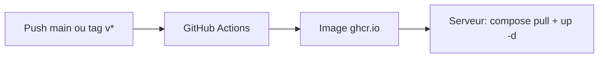

# ISO Watcher

Surveillance automatique de releases ISO (miroirs HTTP/FTP) : détection, API REST, notifications (e-mail, Discord, Teams, Slack, Telegram, ntfy, Pushover, Matrix, webhooks) et stockage local optionnel.

| | |
|---|---|
| **Version** | 0.2.0 |
| **Runtime** | Node.js ≥ 20 |
| **Base par défaut** | SQLite |
| **Base optionnelle** | MySQL / MariaDB |
| **Port par défaut** | 3088 |

## Sommaire

- [À quoi ça sert ?](#à-quoi-ça-sert-)
- [Prérequis](#prérequis)
- [Génération de `INTRANET_SHARED_TOKEN`](#génération-de-intranet_shared_token)
- [Choisir une installation](#choisir-une-installation)
- [Installation rapide (script)](#installation-rapide-script)
- [Développement local](#développement-local)
- [Docker](#docker)
  - [Mises à jour automatiques (CI → docker compose pull)](#mises-à-jour-automatiques-ci--docker-compose-pull)
- [Après l’installation](#après-linstallation)
- [Interfaces web](#interfaces-web)
- [Configuration](#configuration)
- [Fonctionnalités](#fonctionnalités)
- [API et authentification](#api-et-authentification)
- [Stockage local des ISO](#stockage-local-des-iso)
- [Scans, logs et redémarrage](#scans-logs-et-redémarrage)
- [Structure du dépôt](#structure-du-dépôt)
- [Dépannage](#dépannage)
- [Documentation](#documentation)
- [Crédits](#crédits)
- [Licence](#licence)

## À quoi ça sert ?

1. Vous configurez des **sources** (URL de répertoires ISO + regex de filtrage).
2. Le service **scanne** périodiquement ou à la demande.
3. Les **nouvelles releases** sont enregistrées en base et peuvent déclencher des **notifications**.
4. Optionnellement, les fichiers ISO sont **téléchargés** sur disque (`STORAGE_ROOT`).

Cas d’usage typiques : miroir interne, veille sur Ubuntu/Debian/Arch, alertes équipe infra, catalogue intranet.

## Prérequis

| Mode | Besoin |
|------|--------|
| **Développement** | Node.js 20+, npm, `git clone` |
| **Script `install.sh`** | Debian ou Ubuntu, `apt`, `systemd`, root ou `sudo` |
| **Docker** | Docker Engine + Compose v2 |

Fichier obligatoire avant tout démarrage : **`.env`** (copié depuis [`.env.example`](.env.example)) avec au minimum `INTRANET_SHARED_TOKEN` défini (voir [génération du token](#génération-de-intranet_shared_token) ci-dessous).

## Génération de `INTRANET_SHARED_TOKEN`

Secret **obligatoire** au démarrage. Il reste dans le fichier **`.env` sur le serveur**. Utilisez le **même** token côté intranet PHP ou atre pour les appels API.

1. Ouvrez le générateur en ligne : [IT Tools - Token generator](https://it-tools.tech/token-generator)
2. Générez un token (longueur conseillée : **64 caractères** ou plus)
3. Collez-le dans `.env` :

```env
INTRANET_SHARED_TOKEN=
```

> Le script [`install.sh`](scripts/install.sh) peut aussi générer un token automatiquement à l’installation. Ne commitez jamais `.env` dans le cas où vous effectuez un fork du projet.

## Choisir une installation

| Objectif | Méthode |
|----------|---------|
| Serveur Debian/Ubuntu (prod, LXC) | [Script `scripts/install.sh`](#installation-rapide-script) |
| Serveur + base MariaDB locale | Script avec `--mysql` |
| Test / dev sur poste de travail | [Développement local](#développement-local) |
| Conteneur, SQLite seul | [Docker Compose](#docker) - `pull` + `up -d` |
| Conteneur + MySQL | `docker-compose.mysql.yml` |
| Mise à jour prod Docker | `docker compose pull && docker compose up -d` |

## Installation rapide (script)

Dépôt : [github.com/sannier3/ISO-WATCHER](https://github.com/sannier3/ISO-WATCHER) - script : [`scripts/install.sh`](https://github.com/sannier3/ISO-WATCHER/blob/main/scripts/install.sh)

Script cible **Debian / Ubuntu** : installe Node 20, clone le dépôt dans `/opt/iso-watcher`, crée `.env`, installe les dépendances npm et l’unité systemd `iso-watcher`.

**LXC / conteneur (souvent déjà root, sans `sudo`) :**

```bash
curl -fsSL https://raw.githubusercontent.com/sannier3/ISO-WATCHER/main/scripts/install.sh | bash
```

**Machine classique avec `sudo` :**

```bash
curl -fsSL https://raw.githubusercontent.com/sannier3/ISO-WATCHER/main/scripts/install.sh | sudo bash
```

**Avec MariaDB** (paquet `mariadb-server`, base + utilisateur, `DB_DRIVER=mysql` dans `.env`) :

```bash
curl -fsSL https://raw.githubusercontent.com/sannier3/ISO-WATCHER/main/scripts/install.sh | bash -s -- --mysql
```

**Options utiles :**

```bash
bash scripts/install.sh --help
bash scripts/install.sh --dir /opt/iso-watcher --no-start
bash scripts/install.sh --repo sannier3/ISO-WATCHER --branch main
```

**Désinstallation :**

```bash
curl -fsSL https://raw.githubusercontent.com/sannier3/ISO-WATCHER/main/scripts/install.sh | bash -s -- --uninstall
curl -fsSL https://raw.githubusercontent.com/sannier3/ISO-WATCHER/main/scripts/install.sh | bash -s -- --uninstall --purge
```

Variables d’environnement pour le script : `ISO_WATCHER_REPO`, `ISO_WATCHER_BRANCH`, `ISO_WATCHER_INSTALL_DIR`, `MYSQL_DATABASE`, `MYSQL_USER`, `MYSQL_PASSWORD`.

Le service systemd ajoute automatiquement `ReadWritePaths` pour `STORAGE_ROOT` ou `SQLITE_PATH` s’ils sont **en dehors** de `/opt/iso-watcher` (ex. `/mnt/ISO`).

## Développement local

```bash
git clone https://github.com/sannier3/ISO-WATCHER.git
cd ISO-WATCHER
cp .env.example .env
# Définissez INTRANET_SHARED_TOKEN (obligatoire) - voir section « Génération de INTRANET_SHARED_TOKEN »

npm install
npm start
# ou : npm run dev   (rechargement à chaud)
```

## Docker

**Aucun `git clone` n’est nécessaire** : il suffit de récupérer `docker-compose.yml` (et éventuellement `docker-compose.mysql.yml`) plus un fichier `.env`, puis de lancer l’image publiée sur GHCR.

### Première installation (sans cloner le dépôt)

Créez un dossier dédié (ex. `/opt/iso-watcher-docker`) :

```bash
mkdir -p /opt/iso-watcher-docker && cd /opt/iso-watcher-docker

curl -fsSL -o docker-compose.yml \
  https://raw.githubusercontent.com/sannier3/ISO-WATCHER/main/docker-compose.yml

curl -fsSL -o .env \
  https://raw.githubusercontent.com/sannier3/ISO-WATCHER/main/.env.example

# Définissez INTRANET_SHARED_TOKEN (obligatoire) - voir README, section génération du token
```

**SQLite** (image du registry, sans build local) :

```bash
docker compose pull
docker compose up -d
```

**MySQL** (téléchargez aussi le compose MySQL) :

```bash
curl -fsSL -o docker-compose.mysql.yml \
  https://raw.githubusercontent.com/sannier3/ISO-WATCHER/main/docker-compose.mysql.yml

# .env : DB_DRIVER=mysql + mots de passe alignés avec docker-compose.mysql.yml
docker compose -f docker-compose.mysql.yml pull
docker compose -f docker-compose.mysql.yml up -d
```

### Si vous avez déjà cloné le dépôt

```bash
cp .env.example .env
# INTRANET_SHARED_TOKEN obligatoire
# Image par défaut : ghcr.io/sannier3/iso-watcher:latest (voir ISO_WATCHER_IMAGE)
docker compose pull && docker compose up -d
```

**Build local** (dev, sans attendre la CI) :

```bash
docker compose -f docker-compose.yml -f docker-compose.build.yml up -d --build
```

Données persistantes : volumes `iso_watcher_data` (SQLite) ou `iso_watcher_storage` + `iso_watcher_mysql`.

### Mises à jour automatiques (CI → `docker compose pull`)

Flux recommandé :



1. **CI** : le workflow [`.github/workflows/docker-publish.yml`](.github/workflows/docker-publish.yml) pousse sur **ghcr.io/sannier3/iso-watcher** :
   - push sur `main` → **`latest`** (à utiliser en prod)
   - tag git `v0.2.1` → `0.2.1`, `0.2` (pas de tag `sha-*` publié)

2. **Activer les packages** (une fois sur GitHub) : *Settings → Actions → General* → autoriser les workflows à écrire les packages. L’image sera visible sous *Packages* du dépôt.

3. **Registry privé** (optionnel) : sur le serveur, une fois :
   ```bash
   echo "$GITHUB_TOKEN" | docker login ghcr.io -u VOTRE_USER --password-stdin
   ```

4. **Mettre à jour le serveur** :
   ```bash
   docker pull ghcr.io/sannier3/iso-watcher:latest
   docker compose pull
   docker compose up -d --remove-orphans
   ```
   Ou : `./scripts/docker-update.sh`  
   Ne pas utiliser les anciens tags `sha-…` : préférez **`:latest`** ou une version **`0.2.0`** après tag git.

5. **Épingler une version** (optionnel, après `git tag v0.2.0 && git push origin v0.2.0`) :
   ```env
   ISO_WATCHER_IMAGE=ghcr.io/sannier3/iso-watcher:0.2.0
   ```
   Par défaut (recommandé pour suivre `main`) :
   ```env
   ISO_WATCHER_IMAGE=ghcr.io/sannier3/iso-watcher:latest
   ```

Santé : `curl -s http://127.0.0.1:3088/health`

## Après l’installation

1. Vérifier le service : `curl -s http://127.0.0.1:3088/health`
2. Ouvrir l’interface : `http://<hôte>:3088/`
3. Console admin : `http://<hôte>:3088/admin` (voir [SECURITY.md](SECURITY.md) pour l’auth)
4. Configurer SMTP / notifications si besoin (`.env`)
5. Créer une ISO et des sources via l’admin ou l’API
6. Lancer un scan test : `POST /api/v1/scans` (avec token)

**systemd (installation script) :**

```bash
systemctl status iso-watcher
journalctl -u iso-watcher -f
systemctl restart iso-watcher   # après modification de .env
```

## Interfaces web

| URL | Rôle |
|-----|------|
| `/` | Catalogue public, santé, actions optionnelles |
| `/admin` | Console : ISO, sources, scans, releases, notifications, stockage |
| `/docs` | Documentation API (HTML) |
| `/docs/API.md` | Référence API (Markdown) |
| `/health` | Santé JSON (sans auth) |

## Configuration

Toutes les variables sont documentées dans [`.env.example`](.env.example). Ne commitez **jamais** `.env` dans le cas où vous effectuez un fork du projet.

| Groupe | Variables clés |
|--------|------------------|
| Application | `APP_HOST`, `APP_PORT`, `INTRANET_SHARED_TOKEN`, `CORS_ORIGIN` |
| UI publique | `PUBLIC_UI_*` |
| UI admin | `ADMIN_UI_*` |
| Base de données | `DB_DRIVER`, `SQLITE_PATH`, `MYSQL_*` |
| Stockage ISO | `STORAGE_*` |
| Scans planifiés | `SCHEDULER_*`, `SCAN_STARTUP_RECOVERY` |
| Logs de scan | `SCAN_MAX_LOG_LINES`, `SCAN_LOG_*` (voir section dédiée) |
| Liens morts / rapports admin | `LINK_CHECK_*`, `ADMIN_NOTIFY_CHANNELS`, `ADMIN_EMAIL`, webhooks admin (`ADMIN_DISCORD_*`, `ADMIN_SLACK_*`, `ADMIN_TELEGRAM_*`, `ADMIN_NTFY_*`, …) |
| Notifications utilisateurs | API `POST /users/:id/destinations` - types via `GET /destination-types` (e-mail, Slack, Telegram, ntfy, …) |
| Livraisons | `SMTP_*`, `DELIVERY_CRON`, `DISCORD_*`, `TEAMS_*` |

## Fonctionnalités

- Découverte récursive de répertoires (regex `discovery_regex`)
- Filtrage des fichiers ISO par regex (`match_regex`)
- Scans manuels, par ISO, par source, ou planifiés (cron)
- Notifications immédiates et digest
- Vérification quotidienne des liens de releases
- Récupération des scans interrompus au redémarrage du processus
- Restrictions réseau privé pour les UI (RFC1918)

## API et authentification

Référence complète : [`docs/API.md`](docs/API.md).

**API REST** (`/api/v1/*`) - en-têtes requis :

```http
X-Intranet-Token: <INTRANET_SHARED_TOKEN>
X-Actor-Username: admin
X-Actor-Type: internal
```

**Interfaces web** - session signée `X-UI-Session` (pas de token dans le navigateur). Détails et checklist : [SECURITY.md](SECURITY.md).

Exemple rapide :

```bash
export TOKEN="votre-token"
curl -s -H "X-Intranet-Token: $TOKEN" -H "X-Actor-Username: admin" -H "X-Actor-Type: internal" \
  http://127.0.0.1:3088/api/v1/admin/overview
```

## Stockage local des ISO

**Désactivé par défaut** (`STORAGE_ENABLED=false`).

- Seules les releases **connues en base** sont gérées ; les fichiers hors base ne sont jamais supprimés.
- `STORAGE_USE_SUBFOLDERS=true` → `{STORAGE_ROOT}/{distribution}/{iso}/{fichier}`
- `STORAGE_DOWNLOAD_ON_DETECT=true` → téléchargement à la détection
- API : `POST /api/v1/releases/:id/download`, `GET /api/v1/releases/:id/local-file`

Si `STORAGE_ROOT` pointe vers un montage (ex. `/mnt/ISO`), prévoyez les droits d’écriture et, en systemd, `ReadWritePaths` (géré par `install.sh`).

## Scans, logs et redémarrage

| Variable | Rôle |
|----------|------|
| `SCAN_STARTUP_RECOVERY=interrupt` | Au redémarrage Node, les scans « en cours » passent en **interrompu** (défaut) |
| `SCAN_STARTUP_RECOVERY=ignore` | Ne pas toucher aux scans `running` orphelins |
| `SCAN_MAX_LOG_LINES` | Limite de lignes en base (`0` = illimité) |
| `SCAN_LOG_MIN_LEVEL` | `debug`, `info`, `warn`, `error` - filtre le bruit |
| `SCAN_LOG_API_DEFAULT_LIMIT` | Nombre de logs renvoyés par l’API admin |

Les logs de scan incluent le nom de l’ISO, de la source et l’URL explorée.

## Structure du dépôt

```
iso-watcher/
├── server.js              # Point d'entrée API + planificateur
├── lib/                   # config, base de données, stockage, sessions UI
├── public/                # Interface publique (/)
├── public/admin/          # Console d'administration (/admin)
├── docs/
│   ├── API.md             # Référence API
│   └── api.html           # Page /docs
├── scripts/
│   ├── install.sh         # Installation Debian/Ubuntu + systemd
│   └── docker-update.sh   # pull + up -d (image registry)
├── .github/workflows/
│   └── docker-publish.yml # Build CI → ghcr.io
├── Dockerfile
├── docker-compose.yml     # SQLite
├── docker-compose.mysql.yml
├── .env.example           # Modèle de configuration
├── SECURITY.md
└── LICENSE
```

## Dépannage

| Problème | Piste |
|----------|--------|
| `INTRANET_SHARED_TOKEN est obligatoire` | Créer `.env` depuis `.env.example` |
| Service actif mais 502 / crash | `journalctl -u iso-watcher -n 100` |
| Échec écriture stockage | Vérifier `STORAGE_ROOT` et `ReadWritePaths` systemd |
| Scan bloqué « En cours » | Redémarrer le service (`SCAN_STARTUP_RECOVERY=interrupt`) ou passer en `ignore` |
| `better-sqlite3` échoue à l’install npm | `build-essential` + `python3` (Debian/Ubuntu) |
| Docker unhealthy | Attendre le `start_period`, vérifier `INTRANET_SHARED_TOKEN` et les logs conteneur |

## Documentation

| Document | Contenu |
|----------|---------|
| [docs/API.md](docs/API.md) | Référence API complète |
| [SECURITY.md](SECURITY.md) | Auth, UI, réseau, checklist déploiement |
| [.env.example](.env.example) | Toutes les variables d’environnement |

Intégration **PHP** ou autre client HTTP : possible via l’API ; le service Node.js reste **autonome** (aucun PHP requis).

## Crédits

Ce projet (code, documentation et fichiers de configuration d’exemple) a été **réalisé avec l’assistance d’une intelligence artificielle** (IA générative), sous relecture et validation humaines.

## Licence

MIT - voir [LICENSE](LICENSE).
